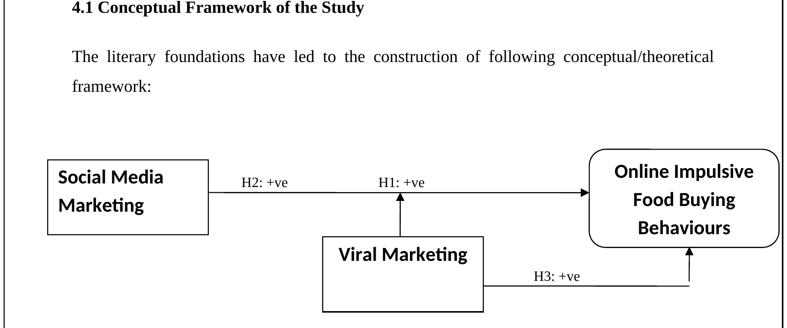
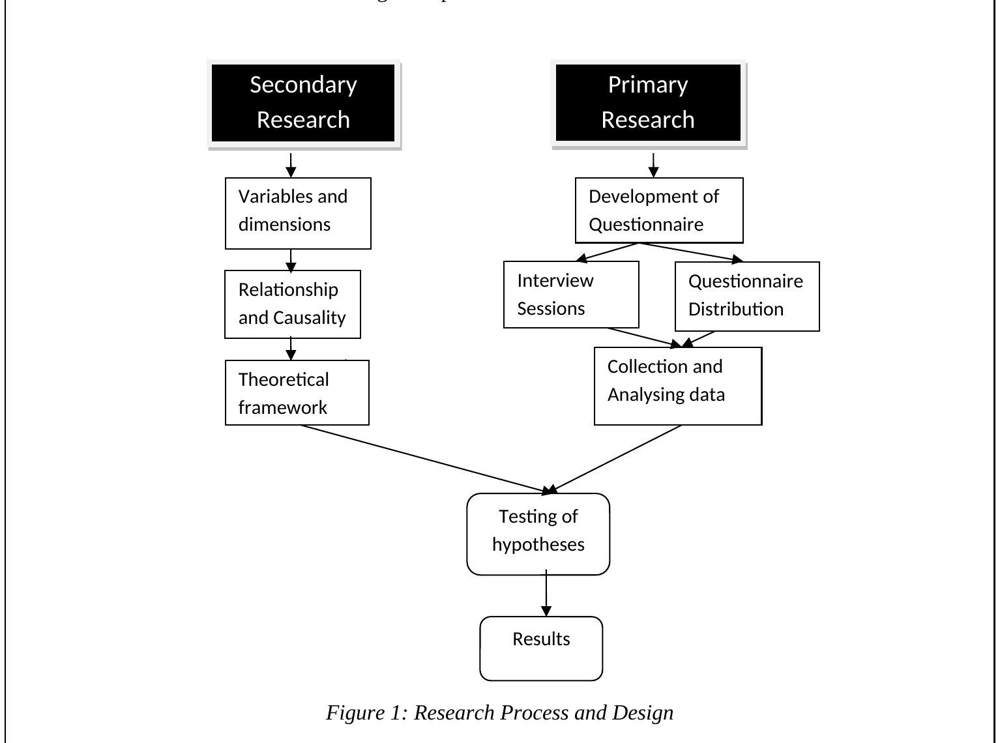
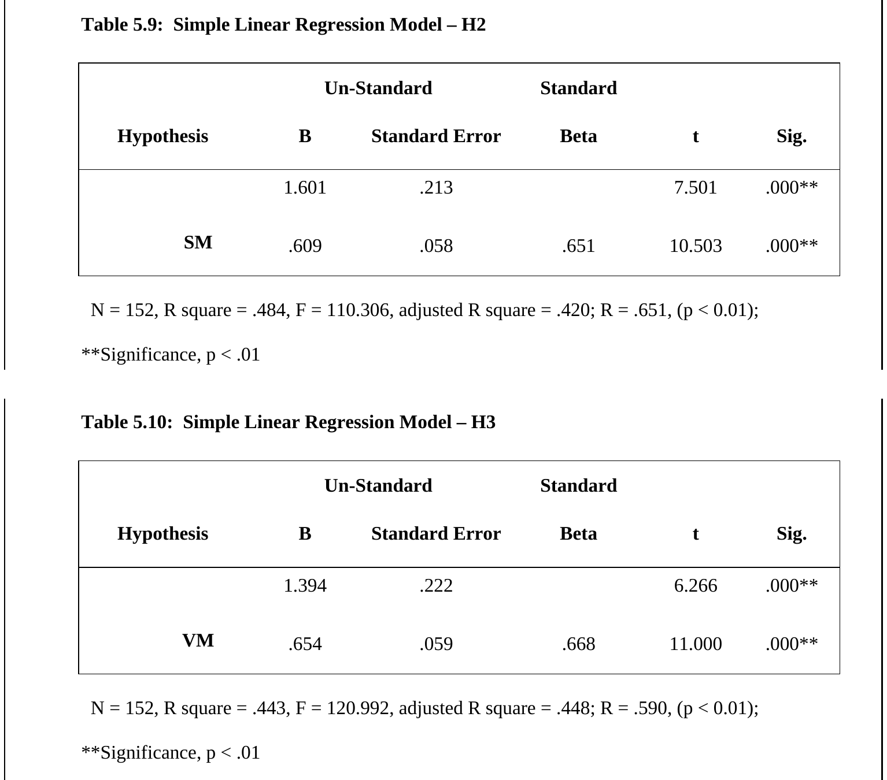

# Social Media Marketing and Online Impulsive Buying Behaviour Analysis

**Research Project | Quantitative Research | SPSS**

---

## Overview

This repository contains my undergraduate research project investigating the impact of social media marketing on online impulsive buying behaviour in Pakistan's online food industry.

The research examines how social media marketing and viral marketing influence consumer purchasing decisions using survey-based quantitative research and statistical analysis.

---

## Research Objectives

- Investigate the impact of social media marketing on online impulsive buying behaviour.
- Analyse the influence of viral marketing on consumer purchasing decisions.
- Evaluate the relationship between marketing activities and consumer behaviour.
- Validate research hypotheses using statistical analysis.

---

## Research Areas

- Consumer Behaviour
- Social Media Marketing
- Digital Marketing
- Quantitative Research
- Statistical Analysis
- Marketing Research
- Business Analytics

---

## Research Methodology

The study followed a quantitative research methodology consisting of:

1. Literature Review
2. Research Framework Development
3. Survey Questionnaire Design
4. Data Collection
5. Data Cleaning
6. Statistical Analysis
7. Correlation Analysis
8. Regression Analysis
9. Hypothesis Testing
10. Results Interpretation

---

## Tools & Technologies

- IBM SPSS Statistics
- Microsoft Excel
- Survey Research Methodology

---

## Statistical Techniques

- Descriptive Statistics
- Reliability Analysis (Cronbach's Alpha)
- Correlation Analysis
- Linear Regression
- Hypothesis Testing

---

## Key Findings

- Social media marketing significantly influences online impulsive buying behaviour.
- Viral marketing positively affects consumers' purchasing decisions.
- Statistical analysis supported the proposed research hypotheses.

---

## Repository Contents

- Research Report (PDF)
- University Project Summary
- Research Methodology
- Literature Review
- Statistical Analysis
- Supporting Figures

---

## Project Figures

### Conceptual Framework

---

### Research Framework

---

### Statistical Analysis

---

## Skills Demonstrated

- Quantitative Research
- Survey Design
- Statistical Analysis
- IBM SPSS
- Data Collection
- Regression Analysis
- Academic Writing
- Research Methodology
- Critical Thinking

---

## Research Status

**Completed Undergraduate Research Project**

This repository contains the final research report, supporting documentation and project figures.

---

## Author

**Anil Emanuel**

Bachelor of Computer Applications (BCA)
